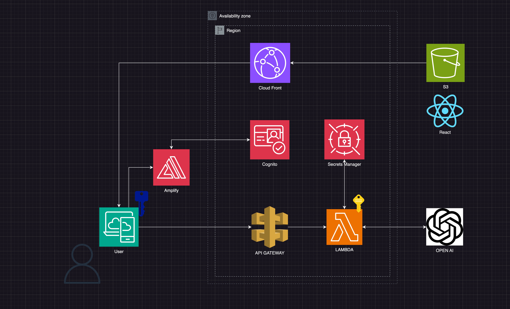
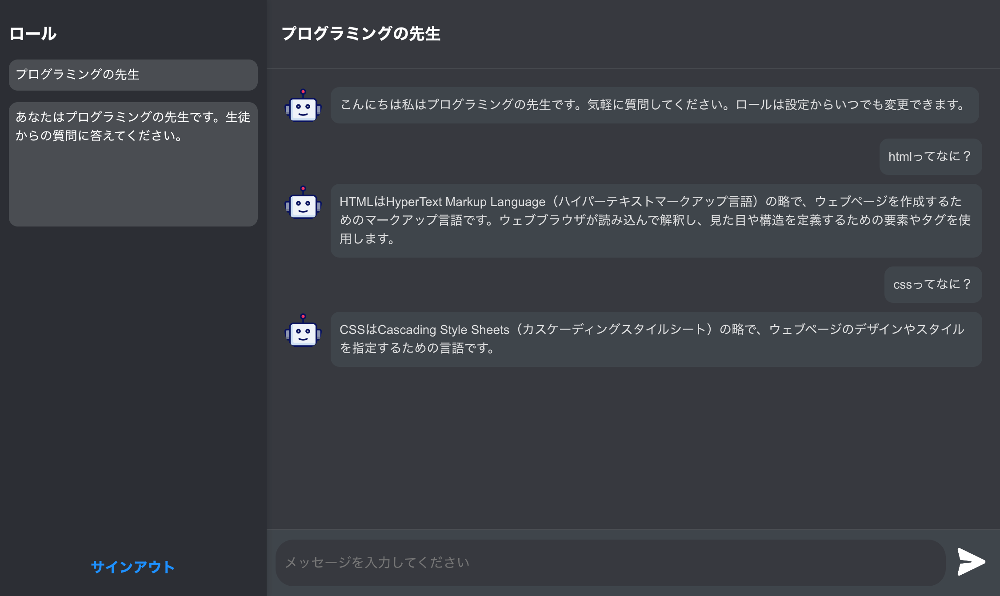

#アーキテクチャ図



このプロジェクトは OpenAI の API をつかった チャット GPT のボットである。ボットにはロールを設定することができ、例えばプログラミングの先生として振る舞ってもらうことができる。ユーザーは自由にロールを変更し、チャット UI 通してボットと会話する。
認証には Cognito と Amplify つかい、APIgateway の Authorizer をパスしたのちに、メインのラムダ関数を呼び出すことができる。呼び出した関数はシークレットマネジャーから OPENAI のアクセスキーを取得し、OPENAI の API を呼び出す。フロントエンドにはリアクトを使用し S3 からクラウドフロントを経てアクセスする。

**注意点**　ゲートウェイのタイムアウトが 29 秒のため、回答が長引くとタイムアウトエラーが発生する。今回のプロジェクトでは、短く簡潔にとプロンプトを入れることで、29 秒を切る場合が多いが、タイムアウトを考慮する場合は WEBSOCKET か ECS などにサービスを移す必要がある。下記が Docker と ElasticBeanstalk を利用した、タイムアウトを考慮したヴァージョンのレポジトリである。

#デプロイ方法

デプロイ前に以下のライブラリを事前にインストールしてください。

-   Amplify CLI
-   AWS SAM CLI

プロジェクトのルートディレクトリで次のコマンドを実行して Amplify プロジェクトを初期化します：

    ```
    amplify init
    ```

##Cognito 認証の追加

次のコマンドを実行して、Cognito 認証をプロジェクトに追加します：

```
amplify add auth
```

表示されるプロンプトに従い、Cognito の設定を完了します。

##OpenAI アクセスキーの Secrets Manager のセットアップ

AWS Secrets Manager に移動します。
「新しいシークレットの作成」をクリックします。
シークレットのタイプとして「その他のタイプのシークレット」を選択し、OpenAI のアクセスキーを入力します。
シークレットの名前と説明を入力します。
キーペアは{key: アクセスキー}となるように入力してください。
シークレットを保存します。

##サムを使ったデプロイ

サムを使って各種サービスをデプロイします。

```
sam deploy --guided
```

SAM デプロイを行う際、以下の情報が必要です：

-   Cognito ユーザープールの ARN
-   Secrets Manager のシークレット名とその ARN

これらを入力して実行した後にリアクトのビルドファイルを S3 にアップロードします。

```
npm build
```

Cloudfront の URL にアクセスすると認証画面に飛ばされます。そこからユーザーを作成し、ログインすればサービスの利用が可能になります。

##サービスイメージ図


